<div align="center">



<br><br>


<br>

[](https://ghostscripts.xyz)
[](https://ghostscripts.tebex.io)


</div>

<br>

## ⚡ whoami

```js
// panic.js — runtime profile
const panic = {
    location:  "Germany",
    role:      "Software Developer · Founder @ Ghostscripts",
    focus:     ["server-side security", "anticheat", "backend systems"],
    languages: ["JavaScript", "C#", "Lua", "Python", "C++", "PHP"],
    beliefs:   [
        "never trust the client",
        "everything server-authoritative",
        "if it can be exploited, it will be",
    ],
    currently: "making cheaters uninstall",
};

module.exports = panic; // handle with care 👻
```

<br>

## 🧬 What I Do

<div align="center">

| 🔐 **Security** | ⚙️ **Backend** | 🎮 **Game Dev** |
|:--:|:--:|:--:|
| Anticheat systems, exploit prevention, server-side validation | APIs, auth & databases — hardened by default | FiveM resources, custom NUI, browser games |

</div>

<br>

## 🛠️ Arsenal

<div align="center">
  
  <br>
  
</div>

<br>

## 🚀 Projects

- 👻 **[Ghostscripts](https://ghostscripts.xyz)** — my studio for premium FiveM resources. ESX & QBCore, custom NUI, escrow-protected. → **[Tebex Store](https://ghostscripts.tebex.io)**
- 🚚 **[Cargo Mafia](https://cargomafia.com)** — browser-based logistics empire game. Build your network, outsmart the competition.
- 🧪 **The Lab** — a bunch of projects that aren't public yet. If you know, you know.

<br>

## 📟 System Status

<div align="center">


</div>

<br>

<div align="center">


</div>
